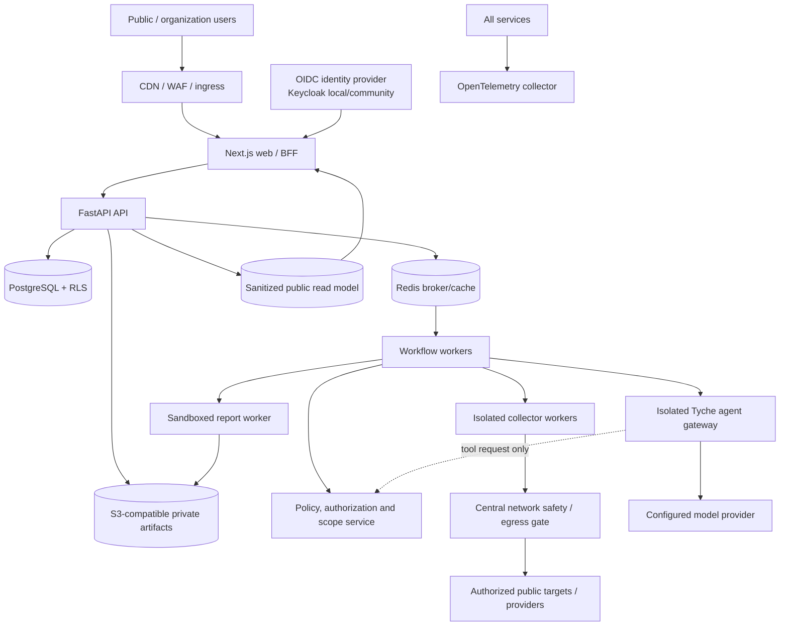
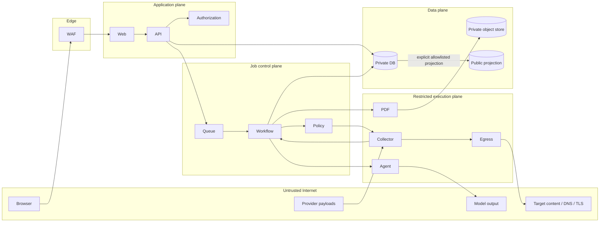
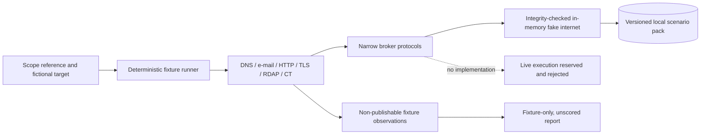

# Target Architecture and Trust Boundaries

## Architecture

The product is a typed monorepo. Next.js provides the public and authenticated browser experience. FastAPI owns APIs, sessions, authorization, tenant state, assessment state, normalized evidence, and policy evaluation. Celery workers use Redis for delivery while PostgreSQL is the authoritative workflow state. Private artifacts live in S3-compatible storage. Network collectors and the Semantic Kernel agent gateway run in separate restricted processes.



## Trust boundaries



Every arrow crossing a boundary has schema validation, identity, authorization, request/run ID, timeout, size limit, and classification. Remote text is data only and is never concatenated into privileged instructions.

## Components and ownership

| Component | Owns | Must not own |
| --- | --- | --- |
| Web/BFF | SSR/UX, secure session exchange, CSRF/origin enforcement | scores, scan policy, provider secrets |
| API | tenant/RBAC, object authorization, state transitions, audit APIs | arbitrary network access |
| PostgreSQL | authoritative tenant/workflow/evidence metadata, RLS defense | public serving of private rows |
| Redis/Celery | bounded task delivery, locks, rate buckets | authoritative business state |
| Workflow worker | deterministic lifecycle, idempotency, cancellation, coverage | free-form authorization decisions |
| Policy/scope service | scope manifest verification and tool/network decisions | network I/O |
| Collector worker | deterministic collection and normalization | model calls, scoring, broad egress |
| Egress gate | DNS resolution, IP classification, redirect revalidation, rate/concurrency policy | tenant business logic |
| Scoring engine | pure versioned check evaluation and aggregation | LLM output |
| Agent gateway | schema-bound planning/explanation | target network, database, queue, secrets, scores |
| Report worker | deterministic HTML/PDF rendering | public links, agent tool execution |
| Public projector | safe allowlisted fields, revocation, cohort privacy | private evidence/findings/assets |

## Core data flow

```mermaid
sequenceDiagram
    participant User
    participant API
    participant Policy
    participant Worker
    participant Collector
    participant Agent
    User->>API: authorize assessment
    API->>Policy: validate verification, consent, target, profile
    Policy-->>API: signed immutable scope manifest
    API->>Worker: idempotent run reference
    Worker->>Policy: authorize planned deterministic step
    Policy-->>Worker: permit + bounded capability
    Worker->>Collector: scope-bound collection request
    Collector->>Policy: reauthorize destination immediately before I/O
    Collector-->>Worker: immutable raw artifact hash + normalized observation
    Worker->>Worker: deterministic evaluation and score
    Worker->>Agent: minimal redacted evidence view + schemas
    Agent-->>Worker: grounded narrative with evidence references
    Worker->>Worker: validate references; omit unsupported sentences
    Worker-->>API: completed/partial result and audit chain
```

## Monorepo shape

```text
apps/web/                    Next.js UI and BFF
services/api/                FastAPI, authz, tenants, public/private APIs
services/worker/             workflow, collectors, scoring, reports
services/agent-gateway/      Semantic Kernel boundary
packages/contracts/          OpenAPI, JSON Schema, generated clients
packages/policy/             versioned checks, weights, caps, mappings
packages/ui/                 tokens and accessible components
infra/compose/               deterministic local stack
infra/containers/            non-root production images
infra/deploy/                production manifests and network policies
tests/fixtures/              fictional/reserved-domain services only
docs/                        architecture, operations, methodology, legal drafts
```

## Data architecture

Tenant-owned tables carry `organization_id`; application authorization and PostgreSQL RLS both enforce it. Historical manifests, normalized observations, evaluations, score snapshots, and audit events are append-only/versioned. Mutable workflow views reference immutable history.

Raw provider/collector artifacts are encrypted, content-hashed, classified, access-logged, and retained for the shortest documented period. Evidence provenance includes adapter/version, source, collection time, scope manifest, content hash, normalizer version, and freshness. Object keys are random and never authorization credentials.

The public projection is physically/logically separate and contains only allowlisted fields: identity, safe score bands/pillar values, date, trend, methodology version, coverage/confidence, and consent/moderation state. Revocation removes the projection without rewriting private history.

## Availability and degradation

API status remains available when workers, providers, or the model fail. Partial observations are preserved and coverage reflects missing steps. Paid adapters return explicit unavailable/unknown states. Redis loss pauses delivery; PostgreSQL state permits reconciliation. Model outage uses deterministic explanation/remediation templates. Public reads use a rebuildable projection and cache.

## Deployment topology

Local development uses Docker Compose with PostgreSQL, Redis, MinIO, Keycloak, Mailpit, ClamAV, OpenTelemetry, and fake DNS/HTTP/TLS fixtures. Production uses independently scalable non-root OCI workloads, managed-equivalent stateful services where chosen, collector egress network policies, secret-manager injection, encrypted backups, restore drills, and signed SBOM/provenance.

Initial SLOs: API availability 99.9% monthly; normal API p95 under 500 ms at agreed load; queued assessment starts within two minutes under normal load. Cross-tenant exposure and out-of-scope I/O have zero error budget.

## Milestone 1 realized boundary

The implemented private path is browser → HTTPS Next.js same-origin rewrite → FastAPI → PostgreSQL. FastAPI owns the provider-neutral OIDC exchange and stores only hashed/encrypted one-time transaction material and opaque server sessions. Next.js never receives provider tokens and keeps the rotated CSRF value in memory. Organization identifiers in routes select a context but do not grant it: FastAPI verifies the current active membership/action/object and PostgreSQL independently applies forced RLS using transaction-local user and organization settings.

PostgreSQL exposes tenant rows to the application role only through active membership or an explicit unexpired support grant. Support access also requires a platform-admin identity with phishing-resistant MFA assurance; the platform role alone returns no tenant rows. Audit events cross the application/data boundary as structured append-only records and cannot be updated or deleted by the application role.

## Milestone 2 realized boundary

The private API now owns canonical domain registration, digest-only DNS/HTTPS challenges, explicit assessment authorizations, and immutable Ed25519 scope manifests. Public Suffix List data is vendored unmodified with pinned upstream provenance. A route identifier never authorizes a domain: application RBAC/object checks and forced tenant RLS remain independent, and parent domains do not authorize child domains.

HTTPS ownership checks cross one purpose-specific broker boundary. The API supplies only tenant/domain/challenge identifiers and the stored canonical host. A database policy adapter re-reads the pending challenge and global, organization, domain, and operation-class emergency controls at every cooperative checkpoint. The broker resolves all addresses, rejects unsafe or mixed results, pins the validated address while preserving TLS identity, accepts only the fixed well-known path, re-resolves redirects, and applies strict time, concurrency, redirect, header, and body budgets. Network decision records exclude IP addresses, response bodies, and challenge values.

Milestone 2 deliberately kept the ownership-verification broker in process because no durable worker existed. Direct network imports were confined by an architecture test. A later durable queue/worker milestone must move the typed network boundary behind restricted egress before any live collector is introduced. Milestone 2 contained no assessment collector, scoring engine, public scan, Tyche integration, or model provider.

## Milestone 3 fixture-only collection boundary

Milestone 3 introduces typed collectors only for deterministic local validation. It does not add a live collector worker or target/provider access.



Collectors cannot construct the fixture broker, import transports, or make generic requests. The runner has stable step ordering, content-addressed evidence, cancellation, and independent partial completion. The API exposes capability status only; there is no execution endpoint. The UI and report surface a persistent non-live warning.

The earlier production diagram remains the target architecture, not current capability. Before its collector-to-egress arrow can exist, all controls in the live-activation dependency must be delivered together and explicitly approved.
