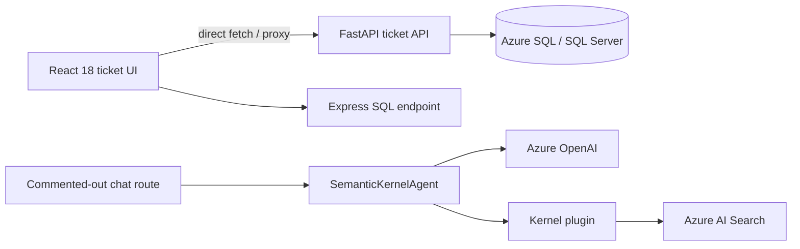

# Repository Audit

**Product:** SIEMBIOT Cyber Health Portal

**Audit date:** 2026-08-03

**SIEMBIOT repository:** independent greenfield repository at this document's root

**Tyche reference:** `https://github.com/microsoft/Tyche.git` at commit `2609c7effcf24ee63147386bb378e2f3b4ce2e9d`

## Executive conclusion

The inspected Tyche checkout is accessible, clean, and MIT-licensed, but is a small CRM/ticket-management prototype rather than a production agent platform. SIEMBIOT will not transform it or copy its history, configuration, dependencies, generated files, credentials, or business functionality. Only generic, code-confirmed orchestration and plugin-registration ideas may be independently reimplemented behind stricter contracts and security boundaries.

The new SIEMBIOT repository was chosen to prevent provenance confusion, secret propagation, inherited dependency risk, and accidental coupling to unrelated data models. No Tyche source has been copied.

## Provenance and method

The master brief was read from the supplied attachment:

- size: 40,900 bytes; 1,045 lines;
- SHA-256: `69F18A4C0AC4703EA0055B7217A49F2F9DB186DD2DEF2174F3E36CB1D71A7753`;
- reviewed requirement domains: product model, verification, scoring, Tyche contracts, data model, RBAC, workflow safety, providers, reports, UX, security, privacy/legal, APIs, testing, demo, operations, milestones, and Definition of Done.

Tyche evidence was collected from a local checkout at the commit above. The worktree was clean before and after inspection. The remote URL and commit were verified with Git. Selected files were hashed during the audit; secrets were not copied into this repository.

## Confirmed Tyche architecture

Confirmed by code:

- Python `SemanticKernelAgent` creates a Semantic Kernel, registers a plugin, creates a `ChatCompletionAgent`, and invokes `SequentialOrchestration` using `InProcessRuntime`.
- One prioritization agent is active in the agent class; several other agent/plugin registrations are commented out.
- Search plugins use Azure AI Search and Azure OpenAI endpoints directly.
- An e-mail plugin can perform an outbound POST, but is commented out in agent registration.
- The active FastAPI application exposes ticket and health endpoints. Its chat route is commented out.
- The active React application renders a ticket list. The prior chat UI is commented out.
- An alternate Express ticket endpoint exists in parallel with the FastAPI endpoint.

Not confirmed by code:

- a production multi-agent platform;
- typed/versioned tool or result contracts;
- structured model output validation;
- tenant, RBAC, scope, consent, or tool authorization enforcement;
- durable state, memory, cancellation propagation, budgets, idempotency, or audit records;
- prompt-injection or untrusted-tool-output defenses;
- model-provider abstraction or deterministic fallback;
- production authentication, storage, queue, observability, deployment, or security controls.

The README overstates active behavior: it describes a chat platform, while the checked-in active paths serve ticket data.

## Stack and repository map

| Area | Confirmed state | SIEMBIOT decision |
| --- | --- | --- |
| Frontend | Create React App, React 18, JavaScript, Axios, custom CSS | Reject; use typed Next.js architecture and original design system |
| APIs | FastAPI ticket endpoint plus separate Express ticket endpoint | Reimplement as one versioned FastAPI API; no ticket functionality |
| Agent | Semantic Kernel, Azure chat completion, sequential orchestration | Adapt orchestration concept behind an internal gateway |
| Tools | Decorated Python plugins, mostly Azure AI Search | Adapt registration concept; reject implementations and unrestricted I/O |
| Data | Direct SQL Server queries and provider search indexes | Reject; PostgreSQL system of record and explicit provider adapters |
| Dependencies | npm lockfiles; unpinned Python requirements | Reject dependency set; establish pinned runtimes and reproducible locks |
| Tests/CI | No tests or CI | Build layered tests and release gates from inception |
| Deployment | No Dockerfiles or production topology | Build non-root OCI images, Compose, and production manifests |
| License | MIT, Microsoft copyright | Compatible for ideas/reimplementation; retain independent SIEMBIOT MIT license |

## Baseline quality gates

Commands were run from the Tyche checkout without editing tracked source.

| Command | Result |
| --- | --- |
| `git status --short --branch` | Clean `main`, tracking `origin/main` |
| `npm ls --depth=0` | Pass; root dependency tree consistent |
| `npm ls --depth=0` in `app` | Pass; frontend dependency tree consistent |
| `npm run build` in `app` | Pass; production bundle compiled; browser dataset warning (15 months old) |
| `CI=true npm test -- --watchAll=false` in `app` | Fail, exit 1; zero tests found |
| `python -m compileall -q api` | Pass; syntax compilation only |
| `python -c "import api.main"` | Fail; active database dependency unavailable and omitted from requirements |
| `python -c "import api.sk_agent"` | Fail; Semantic Kernel unavailable in the environment |
| `python -m pip check` | Pass for installed environment; does not validate uninstalled project requirements |
| `npm run` at root | No scripts defined |
| `git diff --check` | Pass |

No repository-defined lint, type-check, backend test, migration, contract, security, container, or smoke-test gate exists. Generated frontend build output from the audit was moved to a disposable temporary directory; the Tyche worktree was returned to clean state.

## Critical security finding and prerequisite

Tracked Tyche backend files contain hard-coded database credentials/defaults and endpoint information. Values are intentionally omitted here. This is a **critical upstream credential exposure and SIEMBIOT launch blocker** until the credential owner confirms revocation/rotation and appropriate Git-history remediation. The Tyche repository remains read-only; SIEMBIOT work does not authorize modifying it. See `docs/security/upstream-credential-exposure.md`.

Other prototype risks include wildcard credentialed CORS, detailed backend errors, direct outbound requests without central SSRF policy or timeouts, direct database access, disabled chat path, no authorization, no tenant separation, no rate limits, and no auditable scope controls.

## Build-versus-adapt decision

Adapt only these ideas after independent security design:

- kernel/service construction behind a provider-neutral interface;
- explicit plugin registration;
- agent specialization and orchestrated stages;
- descriptive tool metadata.

Reject or replace all prototype components listed in `docs/architecture/tyche-adaptation.md`. SIEMBIOT owns normalized evidence, policy evaluation, scores, authorization, and workflow state. The agent may propose a plan and generate grounded narrative; it cannot execute network I/O, mutate evidence, or calculate authoritative scores.

## Target direction and gaps

The target is a greenfield monorepo with Next.js, FastAPI, PostgreSQL, Redis-backed durable workers, S3-compatible artifacts, policy-as-data checks, an isolated collector boundary, and an isolated Semantic Kernel gateway. Public data is served only from a sanitized projection. Details and trust boundaries are in `docs/architecture/target-architecture.md`.

Every substantive capability in the master brief remains unimplemented at Phase 0. Documentation is not evidence that enrollment, verification, scanning, scoring, Tyche analysis, reporting, moderation, or deployment works.

## Audit disposition

Tyche's MIT license permits reuse, but source copying is unnecessary and prohibited by project decision. The confirmed generic patterns are small enough to reimplement with SIEMBIOT-native contracts and tests. Phase 0 may proceed; application implementation remains gated on acceptance of the ADRs, threat model, and implementation plan.
